# Fisioterapia Pélvica

[🇺🇸 English](README.md) | 🇧🇷 Português

Aplicativo de gestão multiplataforma para clínicas de fisioterapia pélvica, feito com Flutter e Supabase. Roda nativamente em Android e iOS, e também é instalável como Progressive Web App (PWA), compartilhando uma única base de código e backend entre as três plataformas.

## Visão geral

O app substitui planilhas e prontuários em papel para uma clínica de fisioterapia solo ou de pequena equipe: cadastro de pacientes e histórico clínico, evolução do tratamento, agendamento de consultas e controle de pagamentos — tudo sobre um banco Postgres com row-level security, garantindo que cada fisioterapeuta veja apenas os próprios dados.

## Funcionalidades

**Pacientes**
- Wizard de cadastro em várias etapas, modelado a partir de uma ficha real de avaliação clínica de fisioterapia pélvica:
  1. Dados pessoais (nome, idade, telefone, profissão)
  2. Anamnese (queixa principal, início dos sintomas, diagnóstico, histórico médico/hábitos de vida)
  3. Histórico ginecológico *(apenas pacientes do sexo feminino)*
  4. Histórico obstétrico, incluindo o registro completo gestação a gestação *(apenas pacientes do sexo feminino)*
  5. Histórico cirúrgico
  6. Função urinária
  7. Função sexual
  8. Função intestinal
  9. Plano de tratamento
  10. Envio de arquivos da ficha de avaliação física (fotos/PDFs, opcional — também pode ser feito depois pela aba de Anexos do paciente)
  11. Valor da consulta
- Visualização completa do prontuário clínico, somente leitura, organizada por seção
- Registro de evolução do tratamento (notas datadas) com histórico de edição
- Anexos (fotos, PDFs) por paciente, categorizados automaticamente, com pré-visualização de imagem no app e entrega via URL assinada segura
- Exclusão reversível (soft delete), e encerramento de tratamento com motivo e observação final (alta, abandono, encaminhamento, outro) — reabrível

**Agenda**
- Visão contínua dos próximos 7 dias de agendamentos, agrupados por dia
- Mudança de status com um toque (agendado, confirmado, atendido, cancelado, faltou, reagendado)
- Criar, editar e excluir agendamentos; vincular a um paciente já cadastrado ou digitar o nome livremente
- Bloqueio de agendamento em datas já passadas

**Financeiro**
- Lançamentos de pagamento vinculados a um paciente (ou avulsos), com forma de pagamento e status
- Relatório mensal com total acumulado e detalhamento por lançamento
- Formatação de valor em tempo real (BRL)
- Exclusão de lançamento

**Painel inicial**
- Card de "próximos 7 dias" que se atualiza sozinho, recalculando o status do agendamento em relação ao horário atual, para que um atendimento passado nunca fique parado como "próximo"
- Visão geral da clínica: pacientes ativos, atendimentos da semana, faturamento do mês

**Conta e perfil**
- Autenticação por e-mail/senha, com cadastro, redefinição de senha e confirmação de e-mail
- Nome, foto de perfil e número do Crefito editáveis
- Alternância entre tema claro/escuro
- Bloqueio biométrico do app no mobile (ocultado automaticamente na web, onde a plataforma não suporta)
- Exclusão de conta pelo próprio usuário, com exclusão em cascata de todos os dados e arquivos armazenados

**Instalável em qualquer lugar**
- Builds nativos para Android e iOS
- Progressive Web App: instalável em Android, iOS (Safari "Adicionar à Tela de Início") e desktop, abre em modo standalone, funciona offline para os assets estáticos, e os links de redefinição de senha/confirmação de e-mail se adaptam automaticamente entre o esquema de URL nativo e a origem web

## Screenshots

| Login | Cadastro | Início |
|---|---|---|
|  | 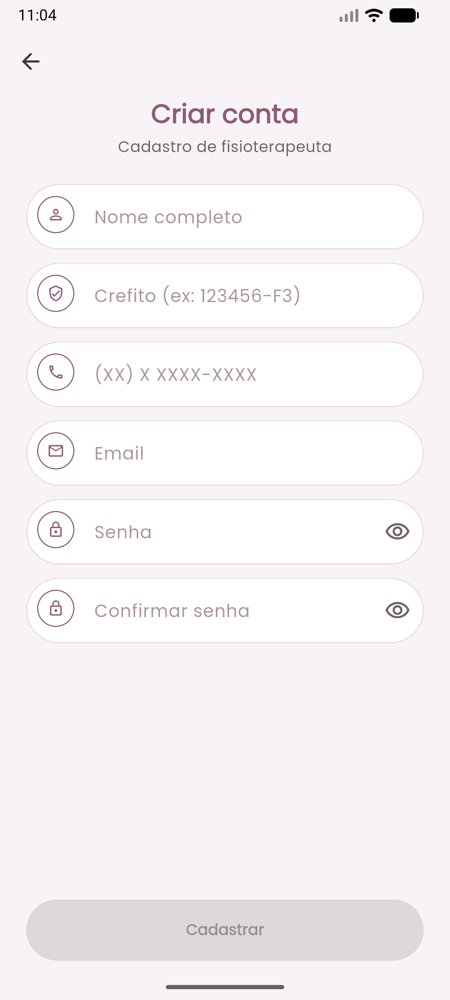 | 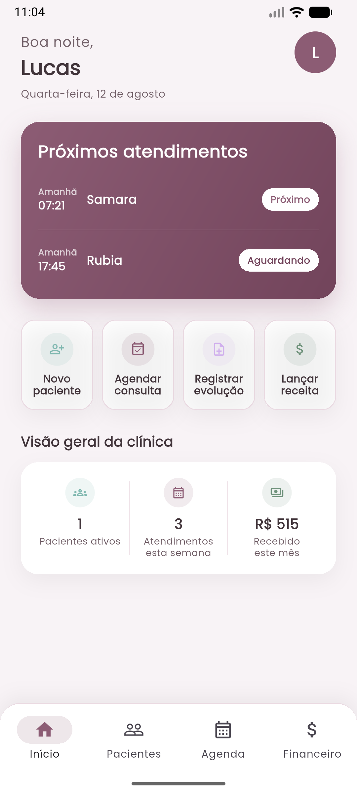 |

| Pacientes | Wizard de cadastro | Prontuário do paciente |
|---|---|---|
| 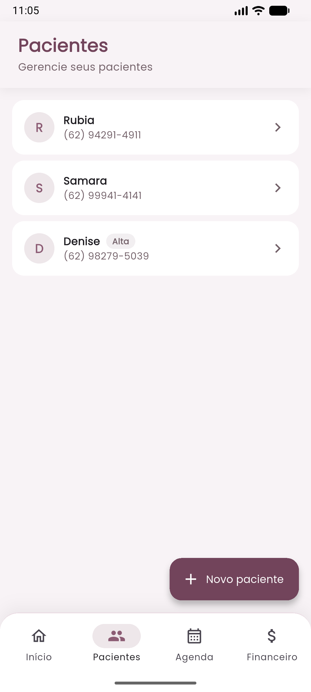 | 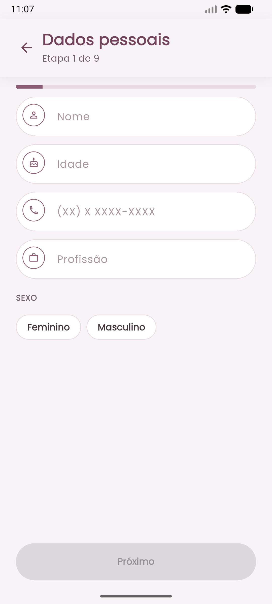 | 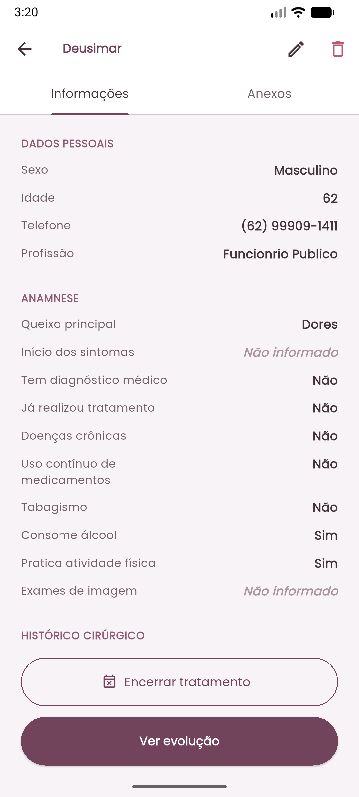 |

| Evolução | Encerramento de tratamento | Agenda |
|---|---|---|
| 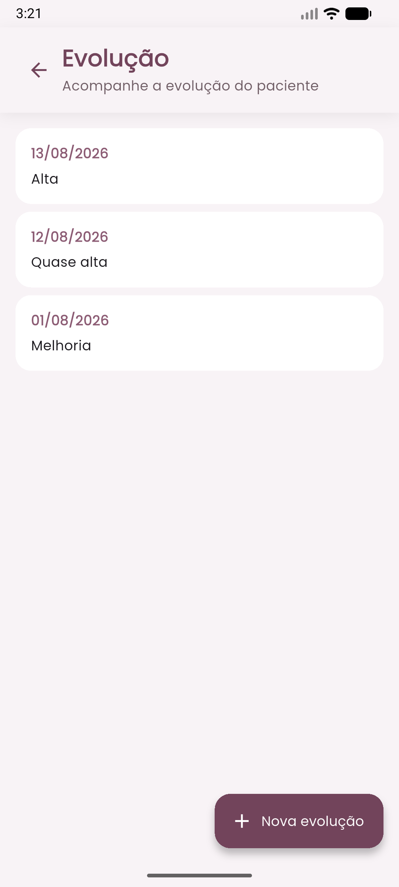 | 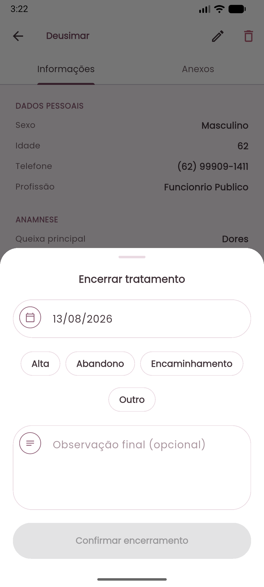 | 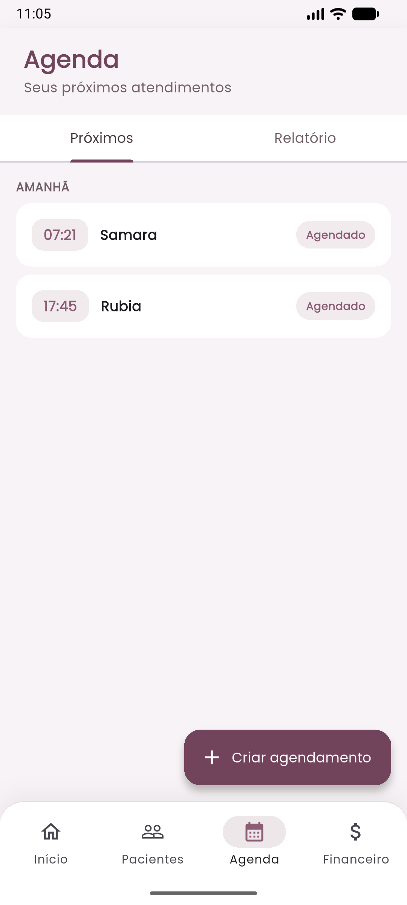 |

| Editar agendamento | Relatório da agenda | Financeiro |
|---|---|---|
| 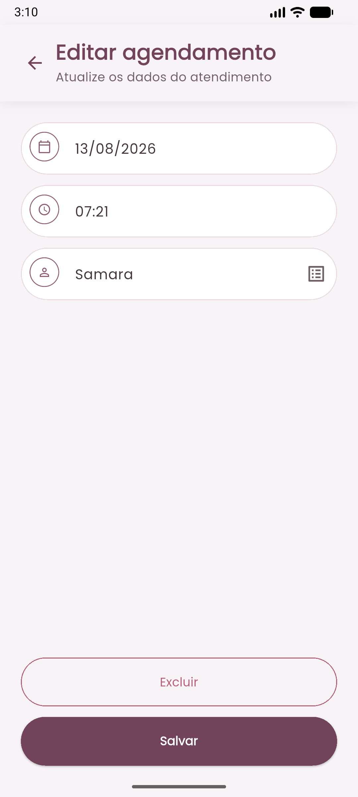 | 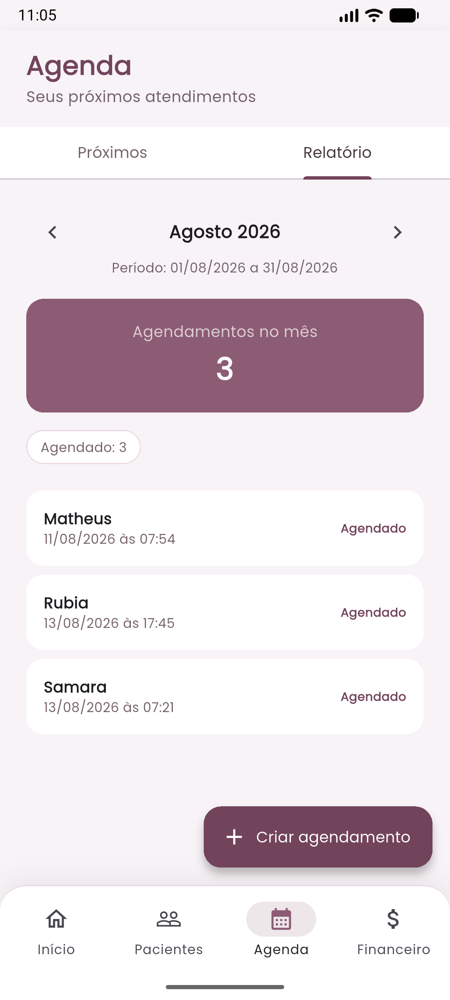 | 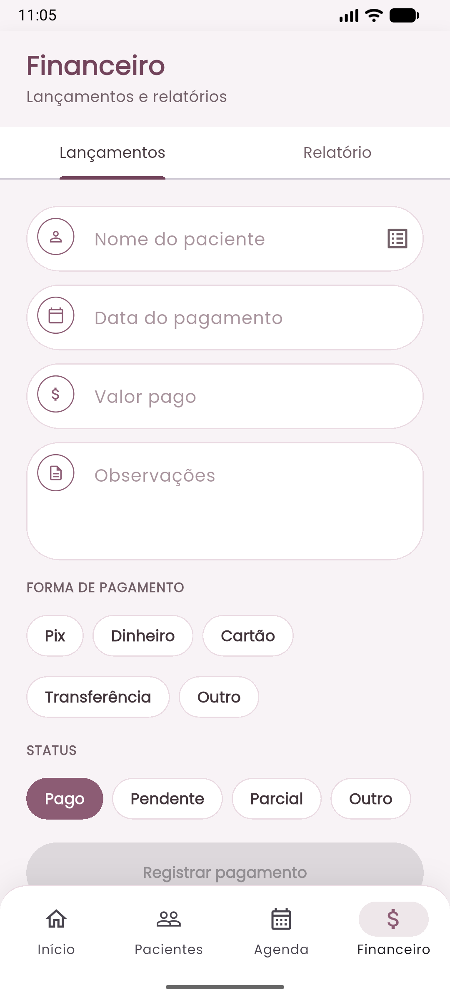 |

| Relatório financeiro | Perfil |
|---|---|
| 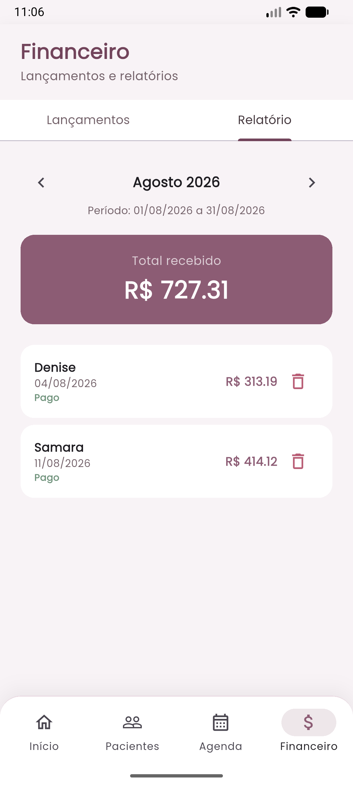 | 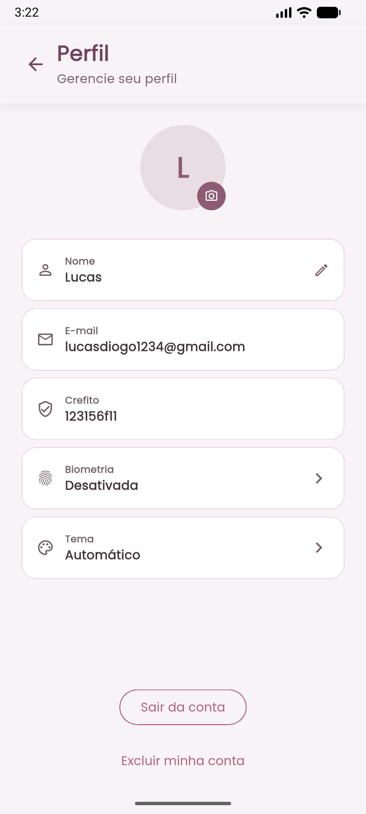 |

## Stack técnica

| Camada | Escolha |
|---|---|
| Framework | Flutter (Android, iOS, Web) |
| Gerenciamento de estado | `flutter_bloc` (Cubit) |
| Backend | Supabase (Postgres, Auth, Storage, Row Level Security) |
| Injeção de dependência | `get_it` |
| Roteamento | `go_router` |
| Hospedagem (web) | Cloudflare Workers (static assets) |
| Testes | `flutter_test`, `bloc_test`, `mocktail` |

## Arquitetura

O código segue uma Clean Architecture pragmática, organizada por feature em vez de por camada no nível raiz:

```
lib/
├── core/            # Preocupações transversais: DI, roteamento, tema, tratamento de erros, config de ambiente
├── shared/          # Widgets e utilitários reutilizáveis, sem conhecimento de nenhuma feature específica
└── features/
    ├── auth/
    ├── patients/
    ├── agenda/
    ├── financial/
    ├── profile/
    └── home/
        ├── data/            # Implementações de repositório (Supabase)
        ├── domain/          # Entidades e interfaces de repositório
        └── presentation/    # Cubits, páginas, widgets
```

Cada feature só tem as camadas que realmente precisa — features simples pulam a cerimônia que uma camada de use-case adicionaria sem benefício real. Erros são modelados explicitamente com um tipo `Result<T>` (`Success` / `Error`) em vez de exceções lançadas atravessando os limites das camadas, então a UI sempre trata os estados de falha de forma deliberada.

Lógica de negócio que não pertence a um widget — como agrupar agendamentos por dia, ou calcular se um horário é "o próximo" ou "já passou" — vive em funções pequenas, puras e testadas unitariamente, em vez de inline dentro de métodos `build()`.

## Como começar

### Pré-requisitos
- Flutter SDK (canal stable)
- Um projeto Supabase (veja `supabase/migrations` para o schema)

### Configuração

```bash
git clone https://github.com/Lucasdiogof/fisioterapia_pelvica.git
cd fisioterapia_pelvica
flutter pub get
cp env.example.json env.json   # depois preencha com a URL e a publishable key do seu Supabase
```

### Executar

```bash
# Mobile (dispositivo ou emulador)
flutter run --dart-define-from-file=env.json

# Web
flutter run -d chrome --dart-define-from-file=env.json
```

### Testar

```bash
flutter test
```

## Deploy

- **Android / iOS**: `flutter build apk` / `flutter build ios` padrão, não publicado na Play Store ou App Store — distribuído como PWA instalável e builds diretos.
- **Web**: `flutter build web --release --dart-define-from-file=env.json`, hospedado como assets estáticos no Cloudflare Workers (veja `wrangler.toml`). O roteamento client-side cai de volta para `index.html` via `not_found_handling = "single-page-application"`.
